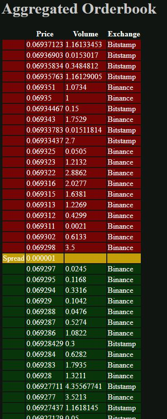

# exchange_interface

<h2>Tech Stack</h2>

<ul>
  <li>Websockets</li>
  <li>GRPC</li>
  <li>Actix</li>
  <li>React</li>
</ul>  
Backend is built with rustc 1.53.0 (53cb7b09b 2021-06-17); 
Change the config.json

To start receiving the quotes. 
1 Open orderbook_server and enter "cargo run", the server will be listeneing 
2 open webserver and enter again "cargo run". 
3 open your browser and enter "127.0.0.1:8080" or whatever the ip you choose on config.json

When you run the server the OrderbookAggregator will start the all the exchanges tasks,  
and set up all the channels. the stream connection with binance can be done in one step  
through the url, while in bistamp we need two steps, first a request connection to the base url 
and then a subscription message.  

bitstamp streams enough data so there is no need for sync (the data enough book depth), 
but in binance case we need to get snapshots to sync incoming small books with the big one.

please check the Aggregated_ob_schema.pdf to check a the project flow.

How to build frontend: 
install nodejs (v16.7.0) and npm (v7.20.3)

npm init -y 
npm install

npm run build

Frontend assets are in www/src and built to www/dist

